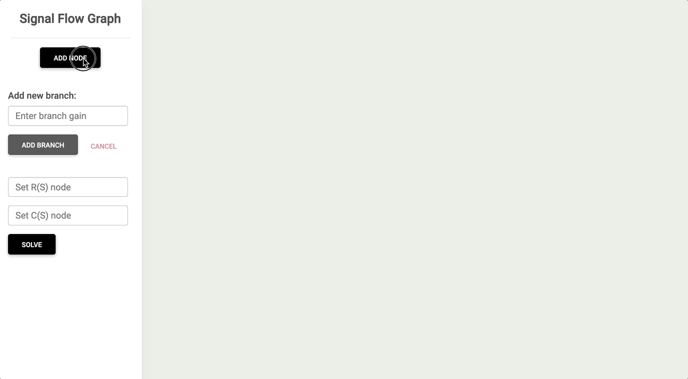

# Signal Flow Graph Web App

# Authors:
Zyad Samy Ramadan
Basel Ahmed Awad
Abdelmoneim Hany Abdelmoneim
Ramy Ahmed El Sayed
Youssef Ahmed Saeed Zaki

## Problem Statement
Given nodes and branches of a signal flow graph, The program does the following :

- Draw the signal flow graph showing nodes, branches, gains, …
- List:
  - all forward paths
  - all individual loops
  - all combination of n non-touching loops.
- The values of delta , delta1 , …, delta-m where m is number of forward paths.
- Calculate overall system transfer function.

---
## How to run
### Front End
  + Clone repository `git clone https://github.com/ZyadSamy/signal-flow-graph.git` 
  + Move to directory `cd signal-flow-graph`
  + Install dependencies using terminal `npm install --legacy-peer-deps` 
  + Run Angular Project using terminal `ng serve -o`

### Back End
  + Import project as maven project and solve dependencies and run it using a Java IDE
  + Move to back end directory `cd backend`
  + Install maven dependencies `mvn install`

---
## How to use

1.	Add nodes needed by clicking on “Add node”, the added nodes will be numbered in an ascending order starting from number 1.
2.	Add branches between nodes by doing the following:
a.	Add branch gain
b.	Click on “Add branch” button
c.	Click on the graph on the node to be drawn from
d.	Click on the node to be drawn to
3.	Keep adding nodes and branches according to your problem.
4.	When done with the graph, type in “input node” the number of the node desired to calculate the transfer function from, and do the same for the output node.
5.	Click on “Solve”.
